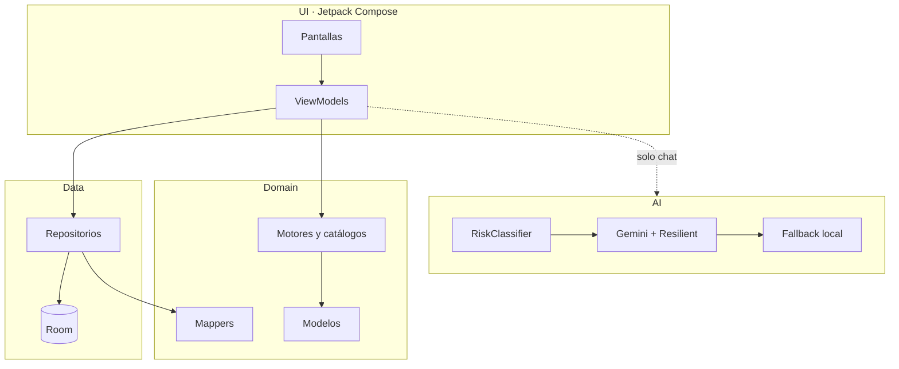

<div align="center">

# Docente Calma

**Bienestar socioemocional para docentes a honorarios del IP Virginio Gómez**

[](https://kotlinlang.org/)
[](https://developer.android.com/)
[](https://developer.android.com/jetpack/compose)
[-gray)](#licencia)

[Características](#-características) · [Inicio rápido](#-inicio-rápido) · [Arquitectura](#-arquitectura) · [Privacidad](#-privacidad) · [Docs](docs/TECHNICAL_OVERVIEW.md)

</div>

> Aplicación Android **nativa**, **offline-first** y **sin login**. Los datos viven en el dispositivo. Complementa la autoobservación; **no sustituye** atención psicológica profesional.

---

## ✨ Características

| Módulo | Qué hace |
|--------|----------|
| **Chequeo emocional** | Registro en menos de 15 s: emoción, intensidad y nota opcional |
| **Recomendaciones** | Motor local que sugiere acciones inmediatas según tu estado |
| **Lecturas breves** | Micromódulos de 3–5 min (feedback, pausas, límites, cierre de jornada…) |
| **Guía de aula** | Escenarios frecuentes con orientación práctica |
| **Ejercicios rápidos** | Respiración 4-7-8, grounding, pausa activa y más |
| **Chat de apoyo** | IA (Gemini) con fallback local y capa de seguridad previa |
| **Autodiagnóstico** | Cuestionario breve con retroalimentación personalizada |
| **Historial y progreso** | Chequeos, recomendaciones y sesiones de chat |
| **Privacidad** | Pantalla dedicada: qué se guarda, qué no y conductos IPVG |

---

## 🚀 Inicio rápido

### Requisitos

- Android Studio **Ladybug (2024.2.1)** o superior  
- **JDK 17+** (el JBR de Android Studio sirve)  
- Android SDK **35**  
- Emulador o dispositivo con **API 26+**

### Clonar y configurar

```bash
git clone https://github.com/xbenjasaez/appvg.git
cd appvg
cp local.properties.example local.properties
```

Edita `local.properties`:

- `sdk.dir` — Android Studio suele completarlo al abrir el proyecto  
- `GEMINI_API_KEY` — opcional; sin clave el chat usa **modo fallback local**

> `local.properties` está en `.gitignore`. **No lo subas a Git.**

### Ejecutar

**Android Studio:** abre la carpeta raíz → espera Gradle → **Run ▶** (`app`).

**Terminal** (Windows):

```powershell
$env:JAVA_HOME = "C:\Program Files\Android\Android Studio\jbr"
.\gradlew.bat assembleDebug
.\gradlew.bat installDebug   # requiere dispositivo o emulador conectado
.\gradlew.bat test
```

---

## 🏗 Arquitectura

Patrón **MVVM + Repository + reglas de dominio**. La capa `ai/` está desacoplada de la UI.



### Convenciones clave

- **Estado:** `MutableStateFlow` interno → `StateFlow` público de solo lectura  
- **Eventos:** `sealed interface` por pantalla  
- **Efectos one-shot:** `Channel` + `receiveAsFlow()` (navegación, snackbars)  
- **Room solo desde repositorios** — los Composables no tocan DAOs  
- **La UI no importa `ai/`** — el ViewModel traduce dominio ↔ turnos de chat  

---

## 📁 Estructura del proyecto

```
app/src/main/java/cl/ipvg/docentecalma/
├── ui/              Pantallas, tema, mascota, componentes
├── navigation/      Rutas, NavHost, NavActions
├── domain/          Modelos, mappers, reglas (RecommendationEngine, MicromoduleCatalog…)
├── data/            Room, DataStore, repositorios, analytics piloto
├── ai/              Gemini, fallback, clasificador de riesgo
└── safety/          Seudónimo de instalación y eventos de riesgo locales
```

Pantallas principales: `home`, `emotionalcheckin`, `recommendations`, `micromodules`, `classroomguidance`, `quickexercises`, `supportchat`, `selfassessment`, `history`, `progress`, `privacy`, `pilotmetrics`, `onboarding`.

## 📚 Documentación técnica

Guía detallada de arquitectura, IA, persistencia y flujos → [`docs/TECHNICAL_OVERVIEW.md`](docs/TECHNICAL_OVERVIEW.md)

---

## 🛠 Stack tecnológico

| Capa | Tecnología |
|------|------------|
| Lenguaje | Kotlin **2.0.21** |
| UI | Jetpack Compose BOM **2024.10.01**, Material 3 |
| Navegación | Navigation Compose **2.8.3** |
| DI | Hilt **2.52** |
| Persistencia | Room **2.6.1** · DataStore **1.1.1** · KSP |
| IA | Google Generative AI **0.9.0** (Gemini) |
| Build | AGP **8.7.2** · Gradle **9** |
| Tests | JUnit 4 · `kotlinx-coroutines-test` |
| SDK | `minSdk` **26** · `compileSdk` / `targetSdk` **35** |

---

## 🤖 Chat con Gemini (opcional)

1. Crea una API key en [Google AI Studio](https://aistudio.google.com/app/apikey).  
2. Añádela en `local.properties` como `GEMINI_API_KEY=...`  
3. Recompila. Sin clave, el chat responde con **reglas locales** (`FallbackSupportChatAi`).

Antes de llamar a Gemini, `RiskClassifier` intercepta mensajes de crisis (autolesión, daño a terceros, abuso) y responde con contención y líneas de emergencia **sin enviar el texto a la red**.

---

## 🔒 Privacidad

| Aspecto | Comportamiento |
|---------|----------------|
| Cuentas | Sin login ni backend propio |
| Datos | 100 % local (Room + DataStore) |
| Chequeos / historial | No salen del dispositivo |
| Chat IA | Solo los mensajes del chat van a Google cuando hay API key |
| Permisos | Principalmente `INTERNET` para el chat |
| Crisis | `RiskClassifier` actúa **antes** de cualquier llamada a Gemini |

Detalle para el usuario final en la pantalla **Privacidad y datos** dentro de la app.

---

## 🧪 Tests

```bash
.\gradlew.bat test
```

Cobertura en mappers, reglas de dominio, `RiskClassifier`, repositorios (fakes) y ViewModels clave. Ver carpeta `app/src/test/`.

---

## 📸 Capturas

<!-- Sustituye por imágenes reales cuando las tengas -->
| Inicio | Chequeo emocional | Chat |
|:------:|:-----------------:|:----:|
| _pendiente_ | _pendiente_ | _pendiente_ |

---

## 🗺 Roadmap (resumen)

<details>
<summary><strong>Ver mejoras planificadas</strong></summary>

- Export/import cifrado del historial  
- Recordatorios opcionales con WorkManager  
- Gráficos de emociones en el tiempo  
- Tests de UI con Compose  
- Strings centralizados en `strings.xml` para i18n  
- Purga automática configurable de datos antiguos  

</details>

---

## Licencia

Proyecto **académico / institucional** del Instituto Profesional Virginio Gómez. Consultar antes de redistribuir.

---

<div align="center">

**IP Virginio Gómez** · Docente Calma `v0.1.1`

</div>
