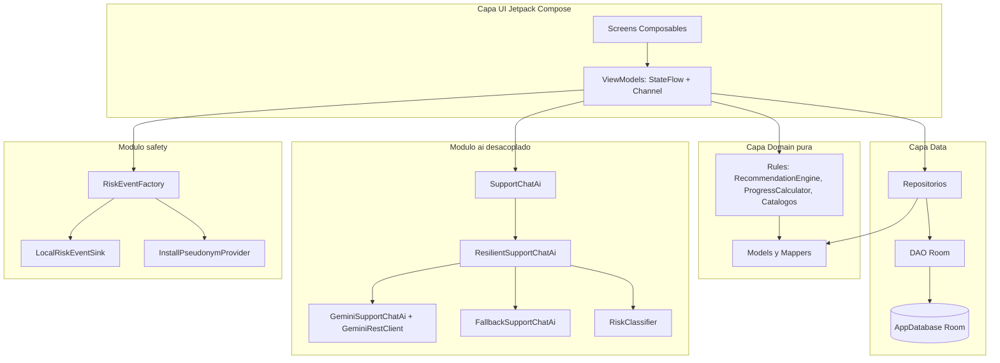
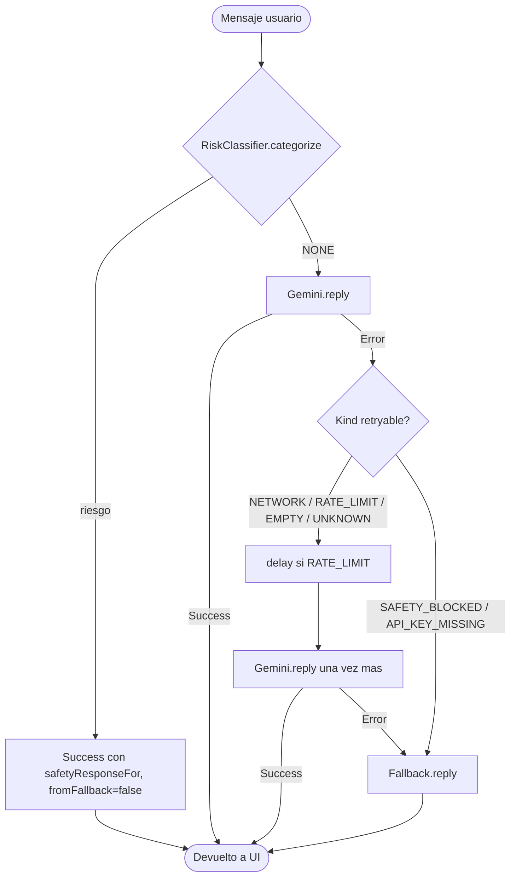
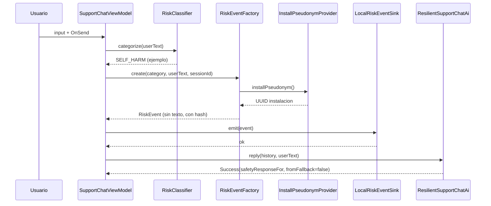
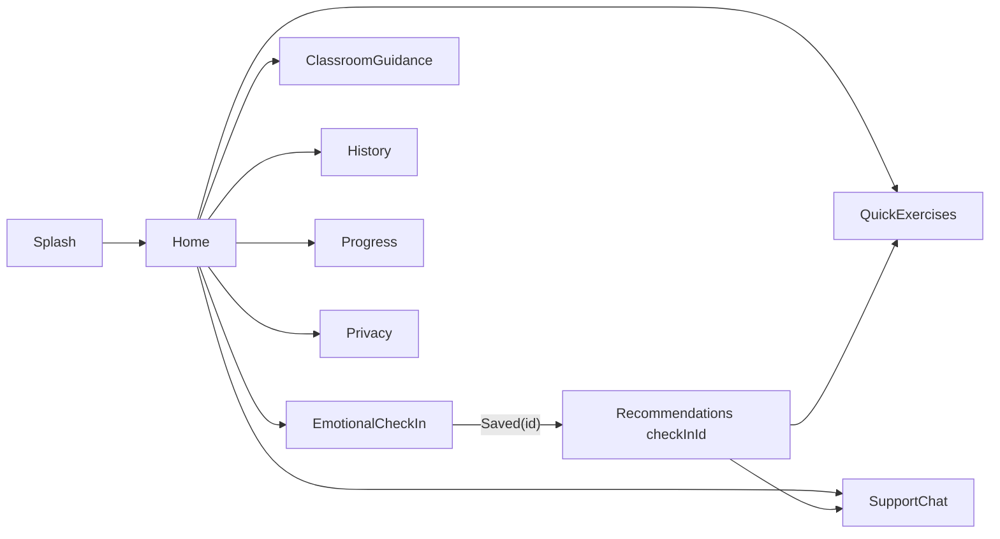

# Docente Calma — Technical Overview

> Documento técnico exhaustivo orientado a desarrolladores que mantienen, auditan o extienden la aplicación. Complementa al [README.md](../README.md) (alto nivel y onboarding) profundizando en los módulos clave: `ai/`, `safety/`, `domain/rules/`, los `ViewModel` de cada pantalla y la capa de `navigation/`.
>
> Toda referencia a código usa el formato `ruta:rango_de_lineas`. Las rutas son relativas a la raíz del repositorio salvo cuando se indique lo contrario.

---

## Tabla de contenidos

1. [Resumen ejecutivo y filosofía del producto](#1-resumen-ejecutivo-y-filosofia-del-producto)
2. [Arquitectura general](#2-arquitectura-general)
3. [Stack y configuración del build](#3-stack-y-configuracion-del-build)
4. [Módulo `ai/` — foco profundo](#4-modulo-ai--foco-profundo)
5. [Módulo `safety/` — foco profundo](#5-modulo-safety--foco-profundo)
6. [Módulo `domain/rules/` — foco profundo](#6-modulo-domainrules--foco-profundo)
7. [Capa `data/`](#7-capa-data)
8. [Modelos y mappers](#8-modelos-y-mappers)
9. [Capa UI, mascota y ViewModels](#9-capa-ui-mascota-y-viewmodels)
10. [Navegación](#10-navegacion)
11. [Testing](#11-testing)
12. [Privacidad y contrato de datos](#12-privacidad-y-contrato-de-datos)
13. [Limitaciones técnicas conocidas](#13-limitaciones-tecnicas-conocidas)

---

## 1. Resumen ejecutivo y filosofía del producto

**Docente Calma** es una aplicación Android nativa de bienestar socioemocional, dirigida a docentes a honorarios del **Instituto Profesional Virginio Gómez (IP Virginio Gómez)**. Es un cliente único, sin backend propio, con persistencia íntegramente local en el dispositivo y un único canal de salida hacia la red: la API de Google Generative AI (Gemini), exclusivamente cuando la usuaria o el usuario escribe en el chat de apoyo y siempre que el filtro previo de riesgo lo permita.

Principios de diseño:

- **Offline-first**: el flujo principal (chequeo emocional, recomendaciones, ejercicios, historial, progreso, guía de aula) funciona 100 % sin red. Solo el chat de apoyo requiere conectividad y degrada limpiamente sin ella.
- **Sin login, sin sincronización, sin telemetría externa**: no hay autenticación, ni cuentas, ni analytics, ni crash reporting. La superficie de datos personales hacia el exterior se reduce al mensaje del chat enviado a Gemini, y solo cuando no se detecta riesgo.
- **Desacoplamiento del proveedor de IA**: la UI conoce únicamente el contrato `SupportChatAi`. El backend del modelo (`GeminiSupportChatAi` + `GeminiRestClient`) puede sustituirse por otro proveedor sin tocar las pantallas.
- **Safety layer determinista**: un clasificador de riesgo (`RiskClassifier`) se ejecuta antes que cualquier llamada de red y es la única política con poder para suprimir el contacto con el modelo.
- **Una sola fuente de verdad por pantalla**: cada `ViewModel` expone un `StateFlow<UiState>` inmutable y, cuando aplica, un `Channel<Effect>` para efectos one-shot (navegación, snackbars).
- **Reglas de dominio puras**: tanto el motor de recomendaciones (`RecommendationEngine`) como las métricas de progreso (`ProgressCalculator`) son puros y testables sin Android, Room ni Compose.

---

## 2. Arquitectura general

Patrón **MVVM + Repository + Domain rules** con la capa `ai/` desacoplada y un módulo `safety/` adicional para eventos de riesgo.



Reglas estructurales aplicadas en el código:

- **`MutableStateFlow<UiState>` privado** y `StateFlow` expuesto de solo lectura. Ejemplos: `_uiState` / `uiState` en [SupportChatViewModel.kt:52-53](../app/src/main/java/cl/ipvg/docentecalma/ui/screens/supportchat/SupportChatViewModel.kt) y [EmotionalCheckInViewModel.kt:22-23](../app/src/main/java/cl/ipvg/docentecalma/ui/screens/emotionalcheckin/EmotionalCheckInViewModel.kt).
- **Eventos de UI** mediante `sealed interface ...Event` con `data object` / `data class`. Por ejemplo `SupportChatEvent.OnInputChanged`, `OnSend`, `OnRetry`, `OnClearSession`, `DismissError`, `DismissFallbackNotice`.
- **Efectos one-shot** mediante `Channel<...Effect>` expuesto como `Flow` con `receiveAsFlow()`. Ejemplo en [EmotionalCheckInViewModel.kt:25-26](../app/src/main/java/cl/ipvg/docentecalma/ui/screens/emotionalcheckin/EmotionalCheckInViewModel.kt) (`Channel<EmotionalCheckInEffect>(Channel.BUFFERED)`).
- **Sin acceso directo a Room desde Composables**: los Composables solo consumen `StateFlow` del `ViewModel`; la lectura/escritura pasa siempre por un repositorio.
- **Sin lógica de negocio en Composables**: los agregados (severidad, intensidades, ventanas semanales) viven en `domain/rules/`.
- **La UI nunca conoce la capa `ai/`**: el `SupportChatViewModel` traduce `ChatMessage` (dominio) ↔ `SupportChatTurn` (módulo `ai/`) en `buildHistory()` ([SupportChatViewModel.kt:221-241](../app/src/main/java/cl/ipvg/docentecalma/ui/screens/supportchat/SupportChatViewModel.kt)).
- **Entities Room separadas de modelos de dominio**: las pantallas y reglas operan sobre `EmotionalCheckIn`, `ChatMessage`, `Recommendation`, etc.; las anotaciones Room solo aparecen en `data/local/entity/*Entity.kt`.

---

## 3. Stack y configuración del build

### 3.1 Versiones (catálogo)

Definidas en `gradle/libs.versions.toml`:

| Componente | Versión |
|---|---|
| Android Gradle Plugin (AGP) | `8.7.2` |
| Kotlin | `2.0.21` |
| KSP | `2.0.21-1.0.28` |
| Compose BOM | `2024.10.01` |
| Activity Compose | `1.9.3` |
| Lifecycle (runtime / runtime-compose / viewmodel-compose) | `2.8.6` |
| Navigation Compose | `2.8.3` |
| Hilt | `2.52` |
| Hilt Navigation Compose | `1.2.0` |
| Room | `2.6.1` |
| Kotlinx Coroutines | `1.9.0` |
| Google Generative AI SDK | `0.9.0` |
| Lottie Compose | `6.6.0` |
| JUnit | `4.13.2` |

Los artefactos de Compose (`androidx-ui`, `material3`, `material-icons-extended`, `ui-tooling`, etc.) **no fijan versión propia** en el TOML; se alinean al Compose BOM `2024.10.01`.

### 3.2 Configuración Gradle del módulo `app`

[`app/build.gradle.kts`](../app/build.gradle.kts):

- **Plugins aplicados**: `com.android.application`, `org.jetbrains.kotlin.android`, `org.jetbrains.kotlin.plugin.compose`, `com.google.devtools.ksp`, `com.google.dagger.hilt.android`.
- **`namespace` y `applicationId`**: `cl.ipvg.docentecalma`.
- **`compileSdk` / `targetSdk`**: 35. **`minSdk`**: 26 (Android 8.0).
- **`versionCode` / `versionName`**: `1` / `"0.1.0"`.
- **`buildFeatures`**: `compose = true`, `buildConfig = true` (necesario para exponer `GEMINI_API_KEY`).
- **`compileOptions` / `kotlinOptions`**: Java 17 / `jvmTarget = "17"`.
- **`buildTypes.release`**: `isMinifyEnabled = false`, ProGuard referenciado (`proguard-android-optimize.txt` + `proguard-rules.pro`). El bloque `debug` no se sobreescribe.
- **`packaging`**: excluye `META-INF/{AL2.0,LGPL2.1}` para evitar conflictos de licencias.
- **`signingConfig`**: no declarada explícitamente (firma debug por defecto; release se debería firmar antes de publicar).

> Nota: con Kotlin 2.0 + plugin `org.jetbrains.kotlin.plugin.compose`, **no se fija `kotlinCompilerExtensionVersion`** porque el compilador de Compose va acoplado al toolchain de Kotlin.

### 3.3 Inyección de la API key

La API key de Gemini **no se hardcodea**: se lee desde `local.properties` en tiempo de build y se expone como `BuildConfig.GEMINI_API_KEY`. El consumidor es `GeminiSupportChatAi` ([GeminiSupportChatAi.kt:29](../app/src/main/java/cl/ipvg/docentecalma/ai/GeminiSupportChatAi.kt)):

```kotlin
private val apiKey: String = BuildConfig.GEMINI_API_KEY
private val isConfigured: Boolean = apiKey.isNotBlank()
```

Si `apiKey` está vacía, `client` queda `null` y cualquier llamada devuelve `AiResult.Error(kind = API_KEY_MISSING)` sin tocar la red.

### 3.4 Manifiesto

[`app/src/main/AndroidManifest.xml`](../app/src/main/AndroidManifest.xml):

- **Permisos declarados**: únicamente `android.permission.INTERNET` (línea 4).
- **Application**: `android:name=".DocenteCalmaApplication"` apunta a la clase `@HiltAndroidApp` ([DocenteCalmaApplication.kt:6-7](../app/src/main/java/cl/ipvg/docentecalma/DocenteCalmaApplication.kt)).
- `allowBackup="true"`, `dataExtractionRules="@xml/data_extraction_rules"`, `fullBackupContent="@xml/backup_rules"`, `supportsRtl="true"`.
- `MainActivity`: `exported="true"` con intent-filter `MAIN` + `LAUNCHER`. No declara `android:configChanges` (las recomposiciones siguen el ciclo estándar de Android).

### 3.5 Recursos (`app/src/main/res/`)

- `mipmap-anydpi-v26/ic_launcher.xml` y `ic_launcher_round.xml`: icono adaptativo.
- `drawable/ic_launcher_foreground.xml`: `layer-list` que referencia `@drawable/ic_launcher_meditating_fox`. **El PNG no aparece indexado** en el árbol explorado (asset pendiente o externo al index del workspace; ver [Limitaciones](#13-limitaciones-tecnicas-conocidas)).
- `values/colors.xml`, `values/strings.xml` (`app_name = "Docente Calma"`), `values/themes.xml`, `values-night/themes.xml` (parents `Theme.Material.Light.NoActionBar` y `Theme.Material.NoActionBar` respectivamente, con barras transparentes y `windowLightStatusBar` apropiado).
- `xml/data_extraction_rules.xml`, `xml/backup_rules.xml`: reglas de backup/transferencia placeholder.

---

## 4. Módulo `ai/` — foco profundo

El módulo `ai/` encapsula toda la integración con LLMs. La regla de oro: **la UI consume `SupportChatAi` y nada más**. La selección de implementación concreta se delega a Hilt.

### 4.1 Contrato `SupportChatAi`

[`SupportChatAi.kt:13-24`](../app/src/main/java/cl/ipvg/docentecalma/ai/SupportChatAi.kt):

```kotlin
interface SupportChatAi {
    suspend fun reply(history: List<SupportChatTurn>, userMessage: String): AiResult
}
```

`SupportChatTurn` ([SupportChatTurn.kt:10-15](../app/src/main/java/cl/ipvg/docentecalma/ai/SupportChatTurn.kt)) es un tipo propio del módulo, deliberadamente desacoplado del modelo de dominio `ChatMessage`. El `SupportChatViewModel` traduce ambos sentidos. Esto permite cambiar el formato de turno (p. ej., agregar `metadata`) sin propagar cambios al dominio.

### 4.2 `AiResult` — algebra de resultados

[`AiResult.kt:11-52`](../app/src/main/java/cl/ipvg/docentecalma/ai/AiResult.kt):

- `sealed interface AiResult`
- `data class Success(val text: String, val fromFallback: Boolean = false) : AiResult` — `fromFallback` permite a la UI mostrar un aviso discreto cuando la respuesta no proviene del modelo primario.
- `data class Error(val kind: ErrorKind, val message: String, val cause: Throwable? = null) : AiResult`
- `enum class ErrorKind { NETWORK, RATE_LIMIT, EMPTY, SAFETY_BLOCKED, API_KEY_MISSING, UNKNOWN }`

Las implementaciones **nunca propagan excepciones esperables**: cualquier `Throwable` se mapea a `Error`. Esto preserva el contrato `suspend` no fallable y permite `when (result)` exhaustivo en el `ViewModel`.

### 4.3 `AiConfig`

[`AiConfig.kt:14-128`](../app/src/main/java/cl/ipvg/docentecalma/ai/AiConfig.kt) — `internal object` con tres constantes/propiedades:

- `MODEL_NAME = "gemini-1.5-flash-latest"` (línea 17). Es solo un fallback conservador: el modelo real se resuelve dinámicamente vía `resolveModelName(...)` (sección 4.5).
- `MAX_HISTORY_TURNS = 10` (línea 23). Aplicado como `takeLast(MAX_HISTORY_TURNS)` para acotar tokens enviados.
- `SYSTEM_PROMPT` (líneas 37-127): prompt multilínea con `trimIndent()` que define identidad, rol, prohibiciones absolutas, conductos institucionales, manejo de riesgo grave, tono y límites de conocimiento. Interpola `${MascotPersona.IDENTITY_PROMPT_LINE}` y `${MascotPersona.NAME}` ([MascotPersona.kt:64-67](../app/src/main/java/cl/ipvg/docentecalma/ui/mascot/MascotPersona.kt)) para mantener una sola fuente de verdad sobre el nombre de la mascota (`Virgi`).

> Modificar este prompt cambia el comportamiento del modelo en producción. Cualquier cambio debería revisarse manualmente con casos límite (riesgo, frustración alta, dudas administrativas).

### 4.4 `GeminiRestClient` — cliente HTTP

[`GeminiRestClient.kt:10-130`](../app/src/main/java/cl/ipvg/docentecalma/ai/GeminiRestClient.kt). Cliente REST minimalista, sin OkHttp ni Retrofit, basado en `HttpURLConnection`.

- **Endpoints**:
  - `GET https://generativelanguage.googleapis.com/v1beta/models?key=$apiKey&pageSize=$pageSize`
  - `POST https://generativelanguage.googleapis.com/v1beta/$modelName:generateContent?key=$apiKey`
- **Tipo auxiliar**: `internal data class GeminiContent(val role: String, val text: String)`.
- **Excepción**: `internal class GeminiHttpException(val code: Int, val body: String) : Exception` lanzada cuando `code !in 200..299`.
- **Timeouts**: 15 s (connect) / 30 s (read) en `listModelsSupportingGenerateContent`; 15 s / 60 s en `generateContent`.
- **Cuerpo enviado** en `generateContent`: JSON con `system_instruction.parts[0].text` y un array `contents` por turno. **No se envían `temperature`, `topK`, `topP` ni `maxOutputTokens`**: la API aplica los valores por defecto del modelo. Personalizar la creatividad/longitud de salida requiere agregar `generationConfig` al JSON.
- **Lectura del body**: extensión privada `HttpURLConnection.readBody(code)` que cierra los streams con `use { ... }`.

### 4.5 `GeminiSupportChatAi` — implementación primaria

[`GeminiSupportChatAi.kt:26-217`](../app/src/main/java/cl/ipvg/docentecalma/ai/GeminiSupportChatAi.kt). `@Singleton` con `@Inject constructor()`. Estado interno:

- `apiKey: String = BuildConfig.GEMINI_API_KEY` (línea 29).
- `isConfigured: Boolean` (línea 30) y `configuredHint: String` (línea 31) para logs sin filtrar la key.
- `client: GeminiRestClient?` lazy: solo se construye si la key existe (línea 33).
- `@Volatile var resolvedModelName: String?` y `bannedModels: MutableSet<String>` para resolución dinámica con bloqueo (`synchronized(bannedModels)` en líneas 85, 182-184).

#### `override suspend fun reply(history, userMessage): AiResult` (líneas 40-110)

1. Si `client == null` → `AiResult.Error(API_KEY_MISSING, "Falta GEMINI_API_KEY en local.properties.")`.
2. Si `userMessage.isBlank()` → `AiResult.Error(EMPTY, ...)`.
3. Cambia a `Dispatchers.IO` y construye `contents = history.toGeminiContents() + GeminiContent("user", userMessage)`.
4. Define `callWithResolvedModel()`: usa `resolvedModelName` o resuelve uno; loguea `Gemini using model=$modelName`; llama `gemini.generateContent(...)` con `AiConfig.SYSTEM_PROMPT` como `systemInstruction` y devuelve `text.trim()`.
5. Bucle de hasta 3 intentos:
   - Si `GeminiHttpException` con `code == 404` y body contiene `"no longer available to new users"` (case-insensitive), o `code == 503` con `"high demand"` → **banea el modelo actual** (`bannedModels.add(current)`), pone `resolvedModelName = null` y reintenta con un modelo distinto.
   - Cualquier otra `GeminiHttpException` se propaga.
6. Si `text.isEmpty()` → `Error(EMPTY)`. Si no, `Success(text)`.
7. Cualquier `Throwable` no manejado pasa por `mapThrowable(t)`.

#### `private fun mapThrowable(t: Throwable): AiResult.Error` (líneas 112-148)

Tabla de mapeo:

| Causa | `ErrorKind` | Mensaje |
|---|---|---|
| `InvalidAPIKeyException` (SDK) | `API_KEY_MISSING` | "API key inválida o revocada." |
| `PromptBlockedException` o `ResponseStoppedException` | `SAFETY_BLOCKED` | `t.message` |
| `IOException` | `NETWORK` | `t.message` |
| `GeminiHttpException` con `code == 429` | `RATE_LIMIT` | "Límite de cuota alcanzado. Reintenta en ~Xs..." parseando `parseRetryAfterMs` |
| `GeminiHttpException` con otro código | `NETWORK` | `t.body` (o "Error HTTP $code...") |
| Cualquier otro | `UNKNOWN` | `t.message` |

- Loguea con `Log.w(TAG, "Gemini reply failed kind=... apiKey=$configuredHint cause=...")`. **Nunca imprime la API key**.
- Para el caso 429 envuelve la causa en `GeminiRateLimitException(retryAfterMs, raw)` ([líneas 150-153](../app/src/main/java/cl/ipvg/docentecalma/ai/GeminiSupportChatAi.kt)) para que `ResilientSupportChatAi` pueda leer el `retryAfterMs`.

#### `private fun parseRetryAfterMs(body: String): Long?` (líneas 155-178)

Estrategia de parseo del cuerpo de error 429:

1. Busca la subcadena `"retryDelay"`. Si existe, extrae el siguiente literal entre comillas (formato `"29s"`), elimina el sufijo `s`, lo convierte a `Long` y multiplica por 1000.
2. Si lo anterior falla, aplica la regex `Regex("Please retry in\\s+([0-9]+(?:\\.[0-9]+)?)s", RegexOption.IGNORE_CASE)`, captura el primer grupo, lo convierte a `Double` y multiplica por 1000.
3. Devuelve `null` si nada hace match.

#### `private fun resolveModelName(client): String` (líneas 180-203)

1. Llama `client.listModelsSupportingGenerateContent()` envuelto en `runCatching` (devuelve lista vacía ante error).
2. Filtra los modelos baneados (`bannedModels`) bajo el lock.
3. Si la lista filtrada está vacía → fallback a `AiConfig.MODEL_NAME` con prefijo `models/` si no lo trae.
4. Orden de preferencia explícito (líneas 190-197):
   1. `models/gemini-2.5-flash`
   2. `models/gemini-2.5-flash-lite`
   3. `models/gemini-2.5-pro`
   4. `models/gemini-1.5-flash`
   5. `models/gemini-1.5-pro`
   6. `models/gemini-pro`
5. Si ninguno calza exactamente, devuelve el primer modelo cuyo nombre contenga `"flash"` (case-insensitive). Si tampoco, el primero de la lista.

#### `private fun List<SupportChatTurn>.toGeminiContents(): List<GeminiContent>` (líneas 205-212)

Aplica `takeLast(AiConfig.MAX_HISTORY_TURNS)` y traduce cada `SupportChatTurn.Role` a los strings que espera la API: `USER → "user"`, `MODEL → "model"`.

### 4.6 `ResilientSupportChatAi` — composición primaria + fallback

[`ResilientSupportChatAi.kt:26-81`](../app/src/main/java/cl/ipvg/docentecalma/ai/ResilientSupportChatAi.kt). Es la implementación que Hilt enlaza al contrato `SupportChatAi`. Recibe por constructor `GeminiSupportChatAi` (primary) y `FallbackSupportChatAi` (fallback).

Flujo de `reply(history, userMessage)`:



Detalles:

1. **Pre-clasificación de riesgo** (líneas 36-42): si `RiskClassifier.categorize(userMessage) != NONE`, devuelve `Success(safetyResponseFor(risk), fromFallback = false)` y **no consulta a Gemini**. La UI marca este caso como "respuesta del modelo" deliberadamente, porque es la política institucional.
2. **Primer intento** al primario (línea 44).
3. **Decisión de retry** (líneas 49-56): se reintenta para `NETWORK`, `RATE_LIMIT`, `EMPTY`, `UNKNOWN`. **No se reintenta** para `SAFETY_BLOCKED` ni `API_KEY_MISSING`.
4. **Espera ante 429** (líneas 59-66): lee `retryAfterMs` del `cause` casteado a `GeminiSupportChatAi.GeminiRateLimitException`. Aplica `delay(retryAfterMs.coerceAtMost(60_000))` o, si es `null`, `delay(1_000)`. El cap de 60 s evita retrasos muy largos.
5. **Segundo intento** al primario (línea 67).
6. **Fallback** (línea 75): si tras el retry sigue fallando o no procedía retry, delega en `FallbackSupportChatAi`.

### 4.7 `FallbackSupportChatAi` — responder local

[`FallbackSupportChatAi.kt:20-76`](../app/src/main/java/cl/ipvg/docentecalma/ai/FallbackSupportChatAi.kt). Implementación local determinista, sin red.

- Si `RiskClassifier.categorize(userMessage)` devuelve algo distinto de `NONE`, responde con `safetyResponseFor(risk)` y **`fromFallback = true`**.
- En caso contrario, normaliza el mensaje (`.lowercase().trim()`) y aplica una cascada de `when` con la extensión privada `String.containsAny(vararg needles): Boolean = needles.any { it in this }`. Las ramas reconocen palabras clave en español para estrés, ansiedad, rabia, tristeza, cansancio, situaciones de aula y saludos. El branch `else` devuelve un mensaje genérico de "sin conexión".
- Resultado: `AiResult.Success(text, fromFallback = true)`.

> El parámetro `history` no se usa en este fallback; la respuesta es independiente del historial.

### 4.8 `RiskClassifier` — barrera defensiva

[`RiskClassifier.kt:22-166`](../app/src/main/java/cl/ipvg/docentecalma/ai/RiskClassifier.kt). `object` sin estado, fácil de auditar y testear.

#### Diseño

- Heurística por subcadena en español, **sin regex en el clasificador** (la única regex en el módulo `ai/` está en `parseRetryAfterMs` para 429).
- Todos los patrones están en minúsculas; la entrada se normaliza con `.lowercase()` y se compara con la extensión privada `List<String>.anyContainedIn(text): any { phrase in text }` (líneas 111-112).
- **Orden de prioridad** explícito (líneas 85-90), de mayor a menor riesgo:

```kotlin
when {
    SELF_HARM.anyContainedIn(lower)           -> RiskCategory.SELF_HARM
    HARM_TO_OTHERS.anyContainedIn(lower)      -> RiskCategory.HARM_TO_OTHERS
    ABUSE_OR_VIOLENCE.anyContainedIn(lower)   -> RiskCategory.ABUSE_OR_VIOLENCE
    ACUTE_CRISIS.anyContainedIn(lower)        -> RiskCategory.ACUTE_CRISIS
    else                                      -> RiskCategory.NONE
}
```

#### Patrones (subcadenas exactas)

| Categoría | Frases (líneas) |
|---|---|
| `SELF_HARM` (24-39) | `suicid`, `matarme`, `quitarme la vida`, `terminar con mi vida`, `acabar con mi vida`, `no quiero vivir`, `no quiero seguir`, `hacerme daño`, `autolesion`, `auto-lesion`, `cortarme`, `dañarme`, `daño a mi mism`, `daño a mí mism` |
| `HARM_TO_OTHERS` (41-52) | `quiero matar`, `voy a matar`, `quiero hacerle daño`, `voy a hacerle daño`, `voy a pegarle`, `quiero pegarle`, `voy a golpear`, `quiero golpear`, `ganas de pegarle`, `le voy a hacer algo` |
| `ABUSE_OR_VIOLENCE` (54-65) | `me pega`, `me golpea`, `me amenaza`, `me agrede`, `abusa de mí`, `abusa de mi`, `abuso sexual`, `violencia intrafamiliar`, `violencia en mi casa`, `me obliga` |
| `ACUTE_CRISIS` (67-76) | `crisis de pánico`, `crisis de panico`, `ataque de pánico`, `ataque de panico`, `no puedo respirar`, `me voy a desmayar`, `estoy colapsando`, `no puedo más` |

> Las frases están deliberadamente en primera persona o con objeto explícito para reducir falsos positivos cuando el docente narra conducta ajena.

#### API pública

| Función | Líneas | Comportamiento |
|---|---|---|
| `fun categorize(userText: String): RiskCategory` | 82-92 | Si el texto está en blanco devuelve `NONE`; si no aplica el `when` priorizado. |
| `fun isBlocking(userText: String): Boolean` | 95-96 | Atajo: `categorize(userText) != NONE`. |
| `fun safetyResponseFor(category: RiskCategory): String` | 103-109 | Selecciona el texto seguro correspondiente; para `NONE` devuelve `GENERIC_SAFETY_REMINDER`. |

#### Mensajes seguros

Constantes privadas (líneas 116-165) construidas con `buildString`. Todos los mensajes:

- Reconocen lo dicho sin minimización ni alarmismo.
- Recuerdan que el chat **no reemplaza atención profesional**.
- Mencionan números chilenos: **Salud Responde 600 360 7777**, **Carabineros 133**, **SernamEG 1455**, **Fonoinfancia 800 200 818**.
- Ofrecen los conductos regulares del IP Virginio Gómez (jefe/a de carrera, registro académico, canal de denuncias en intranet).
- `ACUTE_CRISIS_RESPONSE` además sugiere una respiración 4-4-6 breve in situ.

### 4.9 Hilt: `AiModule`

[`ai/di/AiModule.kt:18-25`](../app/src/main/java/cl/ipvg/docentecalma/ai/di/AiModule.kt):

```kotlin
@Module
@InstallIn(SingletonComponent::class)
abstract class AiModule {
    @Binds
    @Singleton
    abstract fun bindSupportChatAi(impl: ResilientSupportChatAi): SupportChatAi
}
```

**No hay condicionales por API key en Hilt**. Hilt siempre inyecta `ResilientSupportChatAi`, que a su vez recibe `GeminiSupportChatAi` y `FallbackSupportChatAi`. El comportamiento "sin API key" se decide en runtime dentro de `GeminiSupportChatAi` (devuelve `API_KEY_MISSING`) y `ResilientSupportChatAi` baja a fallback automáticamente.

---

## 5. Módulo `safety/` — foco profundo

Pipeline auxiliar que registra eventos de riesgo de manera **mínima y anonimizada**, sin guardar el texto del usuario. Hoy solo escribe en logcat y mantiene un buffer en RAM, preparado para conectar a un sink remoto en el futuro.

### 5.1 Modelo `RiskEvent`

[`RiskEvent.kt:22-48`](../app/src/main/java/cl/ipvg/docentecalma/safety/RiskEvent.kt):

```kotlin
data class RiskEvent(
    val eventId: String,
    val category: RiskCategory,
    val severity: Severity,
    val occurredAt: Instant,
    val pseudoUserRef: String,
    val sessionRef: String,
    val excerptHash: String,
    val source: Source,
    val appVersion: String
) {
    enum class Severity { LOW, MEDIUM, HIGH, CRITICAL }
    enum class Source { SUPPORT_CHAT, OTHER }
}

internal fun RiskCategory.toSeverity(): RiskEvent.Severity = when (this) {
    RiskCategory.SELF_HARM,
    RiskCategory.HARM_TO_OTHERS    -> Severity.CRITICAL
    RiskCategory.ABUSE_OR_VIOLENCE -> Severity.HIGH
    RiskCategory.ACUTE_CRISIS      -> Severity.MEDIUM
    RiskCategory.NONE              -> Severity.LOW
}
```

### 5.2 `RiskEventFactory`

[`RiskEventFactory.kt:23-57`](../app/src/main/java/cl/ipvg/docentecalma/safety/RiskEventFactory.kt). `@Singleton`, recibe `InstallPseudonymProvider`.

`fun create(category, userText, sessionRef, source = SUPPORT_CHAT, now = Instant.now()): RiskEvent`:

- `eventId = UUID.randomUUID().toString()`.
- `severity = category.toSeverity()`.
- `pseudoUserRef = pseudonymProvider.installPseudonym()` (UUID por instalación).
- `sessionRef = sessionRef.take(64)` (truncado defensivo).
- `excerptHash = excerptHash(userText)`.
- `appVersion = BuildConfig.VERSION_NAME`.

`private fun excerptHash(userText: String): String`:

1. `trim()` y `take(200)` caracteres.
2. SHA-256 sobre los bytes UTF-8 (`MessageDigest.getInstance("SHA-256")`).
3. Devuelve los **primeros 16 caracteres** del hex resultante.

Por construcción, el evento **nunca** contiene el texto del usuario en claro. El hash trunco es suficiente para detectar duplicados aproximados sin permitir reconstrucción del mensaje.

### 5.3 `InstallPseudonymProvider`

[`InstallPseudonymProvider.kt:19-38`](../app/src/main/java/cl/ipvg/docentecalma/safety/InstallPseudonymProvider.kt). `@Singleton`, recibe `@ApplicationContext`. Mantiene un UUID por instalación en `SharedPreferences("docentecalma_safety_prefs", MODE_PRIVATE)`, clave `"install_pseudonym"`. Si no existe, lo genera con `UUID.randomUUID().toString()` y lo persiste. **No** usa `ANDROID_ID` ni identificadores de hardware.

### 5.4 `RiskEventSink` y `LocalRiskEventSink`

[`RiskEventSink.kt:12-14`](../app/src/main/java/cl/ipvg/docentecalma/safety/RiskEventSink.kt) define el contrato `suspend fun emit(event: RiskEvent)`.

[`LocalRiskEventSink.kt:20-44`](../app/src/main/java/cl/ipvg/docentecalma/safety/LocalRiskEventSink.kt). `@Singleton`. Implementa el sink localmente:

- `Log.w(...)` con `eventId`, `category`, `severity`, `source`, `appVersion`. **Nunca loguea contenido del mensaje** (de hecho no lo recibe).
- Mantiene un `ArrayDeque<RiskEvent>` con tope de 50 elementos (los más antiguos se descartan).
- `fun snapshot(): List<RiskEvent>` devuelve una copia bajo lock para inspección desde tests.

Hilt enlaza la implementación local a la interfaz en [`safety/di/SafetyModule.kt:21-23`](../app/src/main/java/cl/ipvg/docentecalma/safety/di/SafetyModule.kt):

```kotlin
@Binds
@Singleton
abstract fun bindRiskEventSink(impl: LocalRiskEventSink): RiskEventSink
```

### 5.5 Integración en el chat: `emitRiskEventIfNeeded`

[`SupportChatViewModel.kt:249-261`](../app/src/main/java/cl/ipvg/docentecalma/ui/screens/supportchat/SupportChatViewModel.kt):

```kotlin
private suspend fun emitRiskEventIfNeeded(sessionId: String, userText: String) {
    val category = RiskClassifier.categorize(userText)
    if (category == RiskCategory.NONE) return
    runCatching {
        val event = riskEventFactory.create(
            category = category,
            userText = userText,
            sessionRef = sessionId,
            source = RiskEvent.Source.SUPPORT_CHAT
        )
        riskEventSink.emit(event)
    }
}
```

Características:

- Se invoca en `dispatchMessage` **antes** de persistir el mensaje del usuario y antes de cualquier llamada a `supportChatAi.reply` ([SupportChatViewModel.kt:142-143](../app/src/main/java/cl/ipvg/docentecalma/ui/screens/supportchat/SupportChatViewModel.kt)).
- `runCatching { ... }` traga cualquier excepción: el pipeline de safety **nunca puede romper** el flujo del chat.
- Si la clasificación es `NONE`, no se emite nada (no se generan eventos por defecto para mantener el volumen mínimo).



---

## 6. Módulo `domain/rules/` — foco profundo

Capa pura: ninguna clase de aquí tiene dependencias Android, Room, Compose ni Coroutines. Todas son testeables con JUnit puro.

### 6.1 `EmotionRuleCatalog`

[`EmotionRuleCatalog.kt:12-99`](../app/src/main/java/cl/ipvg/docentecalma/domain/rules/EmotionRuleCatalog.kt).

```kotlin
data class EmotionRule(
    val title: String,
    val immediateAction: String,
    val breathingSuggestion: String,
    val whatToAvoid: String,
    val optionalPedagogicalTip: String?,
    val suggestedExerciseId: String?
)

object EmotionRuleCatalog {
    private val rules: Map<Emotion, EmotionRule> = ...
    fun ruleFor(emotion: Emotion): EmotionRule = rules.getValue(emotion)
}
```

Cada `Emotion` (STRESS, ANXIETY, ANGUST, ANGER, SADNESS, FRUSTRATION, FATIGUE, CALM, HAPPY) tiene una entrada con textos en español y un `suggestedExerciseId` que apunta al catálogo de ejercicios. `CALM` y `HAPPY` no sugieren ejercicio (`suggestedExerciseId = null`).

### 6.2 `RecommendationEngine`

[`RecommendationEngine.kt:24-99`](../app/src/main/java/cl/ipvg/docentecalma/domain/rules/RecommendationEngine.kt). `@Singleton class RecommendationEngine @Inject constructor()`. Solo expone `fun build(checkIn: EmotionalCheckIn): Recommendation`.

#### Composición de la recomendación

`build()` (líneas 27-45):

1. Obtiene `emotion` e `intensity` del `checkIn`.
2. `rule = EmotionRuleCatalog.ruleFor(emotion)`.
3. `exercise = rule.suggestedExerciseId?.let(QuickExerciseCatalog::byId)`.
4. Devuelve `Recommendation(...)` combinando los textos del `rule` con `shortMessage = shortMessageFor(emotion, intensity)` y `severity = severityFor(emotion.category, intensity)`.

#### `private fun shortMessageFor(emotion, intensity): String` (líneas 52-79)

Mensaje empático sin diagnóstico. Construye dos labels (`label = emotion.displayName.lowercase()`, `intensityLabel = EmotionLabels.intensityLabel(intensity).lowercase()`) y selecciona texto según la matriz `category × bucket`:

| Categoría \ Bucket | LOW (1-2) | MID (3) | HIGH (4-5) |
|---|---|---|---|
| `REGULATED_POSITIVE` | "Qué bueno notar..." | "Qué bueno notar..." | "Es un gran recurso para tu día." |
| `DIFFICULT_HIGH_ACTIVATION` | "Buena señal que lo notes a tiempo." | "Atiéndela antes de seguir." | "Cuídate primero; el trabajo puede esperar..." |
| `DIFFICULT_LOW_ENERGY` | "Permítete un pequeño respiro." | "Hacer algo suave puede ayudarte..." | "Es válido detenerte y pedir apoyo." |

`bucketOf(intensity)` (líneas 92-96):

```kotlin
when (intensity) {
    in 1..2 -> Bucket.LOW
    3       -> Bucket.MID
    else    -> Bucket.HIGH   // 4 o 5
}
```

#### `private fun severityFor(category, intensity): SeverityFlag` (líneas 85-90)

```kotlin
when {
    category == EmotionCategory.REGULATED_POSITIVE -> SeverityFlag.NORMAL
    intensity <= 2                                 -> SeverityFlag.NORMAL
    intensity == 3                                 -> SeverityFlag.SUGGEST_CHAT
    else                                           -> SeverityFlag.SUGGEST_PROFESSIONAL
}
```

> Una emoción regulada nunca escala. Una difícil escala a partir de intensidad 3 (sugerencia de chat) y a 4-5 deriva a profesional.

#### `Recommendation.toHistoryType()`

[`Recommendation.kt`](../app/src/main/java/cl/ipvg/docentecalma/domain/model/Recommendation.kt). El orden de evaluación del `when` es relevante:

```kotlin
fun toHistoryType(): RecommendationType = when {
    severity == SeverityFlag.SUGGEST_PROFESSIONAL -> RecommendationType.PROFESSIONAL
    severity == SeverityFlag.SUGGEST_CHAT         -> RecommendationType.CHAT
    suggestedExercise != null                     -> RecommendationType.EXERCISE
    else                                          -> RecommendationType.IMMEDIATE
}
```

### 6.3 `ProgressCalculator`

[`ProgressCalculator.kt:18-125`](../app/src/main/java/cl/ipvg/docentecalma/domain/rules/ProgressCalculator.kt). `object` con dos `data class` y tres funciones puras.

#### Tipos

- `WindowAggregate(windowDays, totalCheckIns, averageIntensity: Double?, countByEmotion, countByCategory, mostFrequentEmotion, mostFrequentCount, difficultShare: Double?, regulatedShare: Double?)` con factory `companion empty(days)`.
- `WeekBucket(index, startAt, endAt, totalCheckIns, averageIntensity: Double?)`.

#### `fun windowOf(checkIns, lastDays, now): List<EmotionalCheckIn>` (líneas 60-67)

```kotlin
val cutoff = now.minus(lastDays.toLong(), ChronoUnit.DAYS)
return checkIns.filter { it.createdAt.isAfter(cutoff) || it.createdAt == cutoff }
```

Filtro **inclusivo** del corte (incluye registros exactamente en el límite).

#### `fun aggregate(window, windowDays): WindowAggregate` (líneas 70-96)

- Si la ventana está vacía → `WindowAggregate.empty(windowDays)`.
- `countByEmotion = window.groupingBy { it.emotion }.eachCount()`.
- `countByCategory = window.groupingBy { it.emotion.category }.eachCount()`.
- `mostFrequent = countByEmotion.maxByOrNull { it.value }`. En caso de empate, el orden de iteración del `Map` decide (no es determinista para empates exactos; revisar en tests si fuera necesario).
- `averageIntensity = window.map { it.intensity }.average()` (promedio aritmético `Double` de Kotlin).
- `difficult = (countByCategory[DIFFICULT_HIGH_ACTIVATION] ?: 0) + (countByCategory[DIFFICULT_LOW_ENERGY] ?: 0)`.
- `regulated = countByCategory[REGULATED_POSITIVE] ?: 0`.
- `difficultShare = difficult.toDouble() / total`, `regulatedShare = regulated.toDouble() / total`.

#### `fun weeklyBuckets(checkIns, bucketCount, now): List<WeekBucket>` (líneas 102-124)

`require(bucketCount > 0)`. Para `index in 0 until bucketCount`:

```kotlin
val endAt   = now.minus((index * 7).toLong(), ChronoUnit.DAYS)
val startAt = endAt.minus(7, ChronoUnit.DAYS)
val inBucket = checkIns.filter {
    (it.createdAt.isAfter(startAt) || it.createdAt == startAt) &&
        it.createdAt.isBefore(endAt)
}
```

Intervalo **semicerrado `[startAt, endAt)`**: cierre por la izquierda, apertura por la derecha (un check-in justo en `endAt` cae en el bucket siguiente, no en este). El bucket 0 cubre los últimos 7 días hasta `now`.

`averageIntensity`: `null` si el bucket está vacío; en caso contrario, promedio aritmético.

### 6.4 Catálogos estáticos

#### `QuickExerciseCatalog`

[`QuickExerciseCatalog.kt`](../app/src/main/java/cl/ipvg/docentecalma/domain/rules/QuickExerciseCatalog.kt). 5 ejercicios:

| ID | Título | Min | Pasos |
|---|---|---|---|
| `breathing_478` | Respiración 4-7-8 | 3 | Inhalar 4 / retener 7 / exhalar 8, 4 ciclos |
| `grounding_54321` | Grounding 5-4-3-2-1 | 4 | 5 cosas que ves, 4 tacto, 3 sonidos, 2 olores, 1 sabor |
| `active_pause` | Pausa activa | 2 | Estiramientos cortos de brazos/hombros + pasos lentos |
| `cognitive_reframe` | Reencuadre cognitivo | 5 | Pensamiento → evidencia → consejo a colega → reformulación |
| `micro_rest` | Micro descanso | 3 | Alejar la vista, ojos cerrados 1 min, agua, una prioridad |

API: `val all: List<QuickExercise>` y `fun byId(id: String): QuickExercise? = all.firstOrNull { it.id == id }`.

#### `ClassroomScenarioCatalog`

[`ClassroomScenarioCatalog.kt`](../app/src/main/java/cl/ipvg/docentecalma/domain/rules/ClassroomScenarioCatalog.kt). 5 escenarios con `steps`, `redFlags` y `whenToEscalate`:

1. **`conflict_with_student`** — Conflicto con un estudiante.
2. **`student_in_distress`** — Estudiante con crisis emocional.
3. **`disruptive_class`** — Grupo disruptivo o clima tenso.
4. **`teacher_overload`** — Sobrecarga del docente.
5. **`safety_risk`** — Riesgo de seguridad o violencia.

Cada `whenToEscalate` referencia conductos institucionales del IP Virginio Gómez (jefe/a de carrera, registro académico, canal de denuncias en intranet).

---

## 7. Capa `data/`

### 7.1 `AppDatabase`

[`AppDatabase.kt:12-31`](../app/src/main/java/cl/ipvg/docentecalma/data/local/AppDatabase.kt). `@Database(entities = [EmotionalCheckInEntity, RecommendationHistoryEntity, ChatMessageEntity], version = 1, exportSchema = false)`. Expone tres DAO: `emotionalCheckInDao()`, `recommendationHistoryDao()`, `chatMessageDao()`. Constante `DATABASE_NAME = "docente_calma.db"`.

[`DatabaseModule.kt:16-43`](../app/src/main/java/cl/ipvg/docentecalma/data/di/DatabaseModule.kt) construye la base con `Room.databaseBuilder(...).fallbackToDestructiveMigration().build()` y provee cada DAO. **No hay migraciones declaradas**; cualquier cambio de esquema borra la base. Esto es aceptable durante MVP pero debe revisarse antes de producción.

### 7.2 Entidades Room

[`EmotionalCheckInEntity.kt:19-42`](../app/src/main/java/cl/ipvg/docentecalma/data/local/entity/EmotionalCheckInEntity.kt):
- `@Entity(tableName = "emotional_check_in", indices = [Index("created_at"), Index("emotion_id")])`.
- Columnas: `id Long PK autoGenerate`, `emotion_id String`, `intensity Int`, `note String?`, `created_at Long` (epoch ms).

[`RecommendationHistoryEntity.kt:15-48`](../app/src/main/java/cl/ipvg/docentecalma/data/local/entity/RecommendationHistoryEntity.kt):
- `@Entity("recommendation_history", indices = [created_at, check_in_id, emotion_id])`. **Sin `ForeignKey`** — decisión intencional para preservar el histórico aunque el check-in original se elimine.
- Columnas: `id`, `check_in_id Long?`, `emotion_id`, `intensity`, `type_id`, `summary`, `acknowledged Boolean`, `created_at Long`.

[`ChatMessageEntity.kt:15-38`](../app/src/main/java/cl/ipvg/docentecalma/data/local/entity/ChatMessageEntity.kt):
- `@Entity("chat_message", indices = [Index("session_id"), Index(["session_id","created_at"])])`.
- Columnas: `id`, `session_id String`, `role_id String`, `content String`, `created_at Long`.

### 7.3 DAOs y consultas SQL

| DAO | Función | Tipo | SQL / nota |
|---|---|---|---|
| `EmotionalCheckInDao` | `observeAll()` | `Flow<List<E>>` | `SELECT * FROM emotional_check_in ORDER BY created_at DESC` |
|  | `observeRange(from, to)` | `Flow<List<E>>` | `WHERE created_at BETWEEN :from AND :to` |
|  | `getById(id)` | `suspend E?` | `WHERE id = :id LIMIT 1` |
|  | `observeLatest()` | `Flow<E?>` | `ORDER BY created_at DESC LIMIT 1` |
|  | `observeEmotionCounts(from, to)` | `Flow<List<EmotionCountRow>>` | `SELECT emotion_id AS emotionId, COUNT(*) AS total ... GROUP BY emotion_id` |
|  | `insert(entity)` | `suspend Long` | `INSERT ... ON CONFLICT ABORT` |
|  | `deleteById(id)` / `deleteAll()` | `suspend Unit` | `DELETE` correspondiente |
| `RecommendationHistoryDao` | `observeAll()` | `Flow<List<R>>` | `ORDER BY created_at DESC` |
|  | `observeForCheckIn(checkInId)` | `Flow<List<R>>` | `WHERE check_in_id = :checkInId ORDER BY created_at DESC` |
|  | `getById(id)` | `suspend R?` | `LIMIT 1` |
|  | `insert(entity)` | `suspend Long` | `ABORT` |
|  | `setAcknowledged(id, acknowledged)` | `suspend Unit` | `UPDATE ... SET acknowledged = :acknowledged WHERE id = :id` |
|  | `deleteById` / `deleteAll` |  |  |
| `ChatMessageDao` | `observeSession(sessionId)` | `Flow<List<C>>` | `WHERE session_id = :sessionId ORDER BY created_at ASC` |
|  | `observeSessionIds()` | `Flow<List<String>>` | `SELECT DISTINCT session_id ... ORDER BY created_at DESC` |
|  | `observeSessionSummaries()` | `Flow<List<ChatSessionSummaryRow>>` | `GROUP BY session_id` con `COUNT(*)`, `MIN(created_at)`, `MAX(created_at)` y subquery escalar para preview (primer mensaje USER) |
|  | `getById`, `insert`, `deleteSession`, `deleteAll` |  |  |

### 7.4 Repositorios

`EmotionalRepository` ([data/repository/EmotionalRepository.kt:18-68](../app/src/main/java/cl/ipvg/docentecalma/data/repository/EmotionalRepository.kt)):

- `observeAll() / observeRange(from, to) / observeLatest()` aplican `.map { ... toDomain() }` sobre el Flow del DAO.
- `observeEmotionCounts(from, to)` mapea filas auxiliares a `Map<Emotion, Int>` filtrando ids desconocidos vía `Emotion.fromId`.
- `suspend fun save(emotion, intensity, note): Long`: valida `intensity in 1..5`, normaliza `note?.trim().ifEmpty { null }`, construye entidad y delega en `dao.insert`.
- `delete(id) / deleteAll()` reenvían al DAO.

`ChatRepository` ([data/repository/ChatRepository.kt:22-68](../app/src/main/java/cl/ipvg/docentecalma/data/repository/ChatRepository.kt)):

- `observeSession(sessionId): Flow<List<ChatMessage>>` con mapeo a dominio.
- `observeSessionIds()`, `observeSessionSummaries()`.
- `suspend fun append(sessionId, role, content)`: `require(content.isNotBlank())`. Inserta entidad sin `id` (auto).
- `suspend fun clearSession(sessionId)`, `suspend fun deleteAll()`.
- `fun newSessionId(): String = UUID.randomUUID().toString()`.

`RecommendationHistoryRepository` ([data/repository/RecommendationHistoryRepository.kt:19-58](../app/src/main/java/cl/ipvg/docentecalma/data/repository/RecommendationHistoryRepository.kt)):

- `observeAll() / observeForCheckIn(checkInId)` con mapeo a dominio.
- `suspend fun log(checkInId, emotion, intensity, type, summary): Long` construye la entidad usando los `id` string de los enums (`emotion.id`, `type.id`).
- `suspend fun setAcknowledged(id, acknowledged)`, `delete`, `deleteAll`.

`ClassroomGuidanceRepository` ([data/repository/ClassroomGuidanceRepository.kt:15-20](../app/src/main/java/cl/ipvg/docentecalma/data/repository/ClassroomGuidanceRepository.kt)) **no usa DAO**: expone `observeScenarios(): Flow<List<ClassroomScenario>> = flowOf(ClassroomScenarioCatalog.all)` y `getScenario(id)`.

---

## 8. Modelos y mappers

### 8.1 Modelos de dominio (`domain/model/`)

- `enum class Emotion(val id, val label, val category)` ([Emotion.kt:12-32](../app/src/main/java/cl/ipvg/docentecalma/domain/model/Emotion.kt)). 9 valores con `companion`: `fromId(id): Emotion?` y `fromIdOrThrow(id): Emotion` (lanza `IllegalStateException` si no existe).
- `enum class EmotionCategory { DIFFICULT_HIGH_ACTIVATION, DIFFICULT_LOW_ENERGY, REGULATED_POSITIVE }`.
- `data class EmotionalCheckIn(...)` con `init { require(intensity in INTENSITY_RANGE) }` (`1..5`).
- `data class ChatMessage`, `enum class ChatRole(val id) { USER("user"), MODEL("model") }` con `fromId` defaulting a `USER`.
- `data class ChatSessionSummary(sessionId, messageCount, firstAt, lastAt, preview)`.
- `data class Recommendation(...)` con `fun toHistoryType(): RecommendationType`.
- `data class RecommendationHistory(...)`.
- `enum class RecommendationType(val id) { IMMEDIATE("immediate"), EXERCISE("exercise"), CHAT("chat"), PROFESSIONAL("professional") }` con `fromId` defaulting a `IMMEDIATE`.
- `enum class SeverityFlag { NORMAL, SUGGEST_CHAT, SUGGEST_PROFESSIONAL }`.
- `data class ClassroomScenario(id, title, summary, steps, redFlags, whenToEscalate)`.
- `data class QuickExercise(id, title, description, durationMinutes, steps)`.

### 8.2 Mappers (`domain/mapper/`)

- `EmotionalCheckInMapper`: `EmotionalCheckInEntity.toDomain()` (Long ms → `Instant`, `emotionId` → `Emotion.fromIdOrThrow`) y `EmotionalCheckIn.toEntity()`.
- `RecommendationHistoryMapper`: análogo con `RecommendationType.fromId`.
- `ChatMessageMapper`: con `ChatRole.fromId`.
- `EmotionLabels`:
  - `displayName(emotion)`, `shortDescription(emotion)`, `categoryLabel(category)`, `intensityLabel(intensity)`.
  - `intensityLabel` aplica `intensity.coerceIn(1, 5)` y devuelve "Muy leve / Leve / Moderada / Intensa / Muy intensa" según el valor.
  - Extensiones: `Emotion.displayName`, `Emotion.shortDescription`, `EmotionCategory.label`.

---

## 9. Capa UI, mascota y ViewModels

### 9.1 Composable raíz, theming y scaffolds

[`DocenteCalmaApp.kt:8-13`](../app/src/main/java/cl/ipvg/docentecalma/ui/DocenteCalmaApp.kt) envuelve todo en `DocenteCalmaTheme` y crea el `NavController` que pasa al `NavHost`.

[`Theme.kt:71-82`](../app/src/main/java/cl/ipvg/docentecalma/ui/theme/Theme.kt): `DocenteCalmaTheme(darkTheme = isSystemInDarkTheme(), content)` selecciona `LightColorScheme` o `DarkColorScheme` y aplica `DocenteCalmaTypography` (`Type.kt`) y `DocenteCalmaShapes` (`Shape.kt`).

Paleta IPVG (`Color.kt`): `IpvgBluePrimary`, `IpvgBlueDeep`, `IpvgBlueVirginio`, `IpvgBlueSoft`, `IpvgYellow`, `IpvgYellowSoft`, `IpvgOrange`, `IpvgOrangeSoft`, `IpvgGreen`, `IpvgGreenSoft`, `IpvgGrayBrand`, `IpvgGrayCool`. Color schemes light y dark fijan primario azul institucional, secundario azul "Virginio", terciario naranja, error rojo estándar, fondos blancos/grises o azul nocturno.

[`DocenteCalmaScaffold.kt:18-24`](../app/src/main/java/cl/ipvg/docentecalma/ui/components/DocenteCalmaScaffold.kt): `@OptIn(ExperimentalMaterial3Api::class)`. Recibe `title`, `onBack: (() -> Unit)?`, `actions: @Composable RowScope.() -> Unit`, `snackbarHost`, `content: @Composable (PaddingValues) -> Unit`. Usa `TopAppBar` con flecha de retroceso opcional.

[`BrandingHeader.kt:31-35`](../app/src/main/java/cl/ipvg/docentecalma/ui/components/BrandingHeader.kt) muestra un encabezado con gradiente primary→secondary, texto onPrimary, mascota `Idle` y dos chips ("IP Virginio Gómez", "Registro académico").

### 9.2 Mascota Virgi

Subpaquete `ui/mascot/`. Todos los símbolos relevantes son `internal`.

- [`MascotState.kt`](../app/src/main/java/cl/ipvg/docentecalma/ui/mascot/MascotState.kt): `sealed interface` con grupos:
  - **Branding**: `Greeting`, `Idle`, `Cheering`.
  - **Chat**: `Listening`, `Thinking`, `Empathic`, `OfflineSad`, `ErrorState`.
  - **Ejercicios**: `Breathing`, `Grounding`, `Stretching`, `Reframing`, `Resting`.
  - **Emoción**: `EmotionCalm`, `EmotionHappy`, `EmotionAnxious`, `EmotionSad`, `EmotionFrustrated`, `EmotionTired`.
- [`MascotMotion.kt:54-151`](../app/src/main/java/cl/ipvg/docentecalma/ui/mascot/MascotMotion.kt): `MascotMotionFactory.forState(state)` devuelve un `MascotMotion` (períodos y amplitudes de escala, `translationY` y rotación) ajustado al estado: respiración suave en Idle/Listening, saludo con leve oscilación, rebote en Thinking, ritmos distintos por ejercicio, vibración en estados de emoción difícil.
- [`MascotResources.kt`](../app/src/main/java/cl/ipvg/docentecalma/ui/mascot/MascotResources.kt):
  - `drawableFor(state)` mapea cada estado a `R.drawable.mascot_*` (PNG).
  - `lottieFor(state)`: hoy retorna `null` en todas las ramas. Se reserva para sustitución gradual por animaciones Lottie.
  - `stateForExerciseId(id)`: mapea `breathing_478 → Breathing`, `grounding_54321 → Grounding`, `active_pause → Stretching`, `cognitive_reframe → Reframing`, `micro_rest → Resting`, default `Idle`.
- [`MascotEmotionMapper.kt:16-27`](../app/src/main/java/cl/ipvg/docentecalma/ui/mascot/MascotEmotionMapper.kt): `Emotion?` → `MascotState`. STRESS/ANXIETY → `EmotionAnxious`; ANGUST/SADNESS → `EmotionSad`; ANGER/FRUSTRATION → `EmotionFrustrated`; FATIGUE → `EmotionTired`; CALM → `EmotionCalm`; HAPPY → `EmotionHappy`; `null` → `Idle`.
- [`MascotPersona.kt`](../app/src/main/java/cl/ipvg/docentecalma/ui/mascot/MascotPersona.kt): `NAME = "Virgi"`, `SHORT_BIO`, `phraseFor(state)`, `IDENTITY_PROMPT_LINE` (referenciada en el system prompt del modelo).
- [`Mascot.kt:53-124`](../app/src/main/java/cl/ipvg/docentecalma/ui/mascot/Mascot.kt) renderiza la mascota: si `MascotResources.lottieFor(state) != null`, usa `LottieAnimation` con `IterateForever`; si no, dibuja el `Image` con `painterResource(drawableFor(state))` aplicando `rememberInfiniteTransition` con escala/`translationY`/rotación animadas. En modo preview o `animate = false`, usa `MascotMotion.None`.
- [`SupportChatBubbleMascot.kt:13-83`](../app/src/main/java/cl/ipvg/docentecalma/ui/screens/supportchat/SupportChatBubbleMascot.kt) define dos helpers:
  - `mascotStateForAssistantBubble(userMessage: String?): MascotState` — heurística por subcadenas en español (frustración/tristeza/ansiedad/cansancio/calma/alegría/"difícil" → `Empathic`, default `Listening`).
  - `lastUserMessageBefore(messages, modelIndex)` — busca el último mensaje USER previo al índice del mensaje del modelo.

### 9.3 ViewModels — detalle por pantalla

Convenciones: cada `@HiltViewModel` recibe sus dependencias por constructor, mantiene `_uiState: MutableStateFlow<UiState>` y expone `uiState: StateFlow<UiState>`. Los efectos one-shot, cuando existen, viajan por `Channel<...Effect>(BUFFERED)` expuesto como `Flow` con `receiveAsFlow()`.

#### `HomeViewModel`

[`HomeViewModel.kt`](../app/src/main/java/cl/ipvg/docentecalma/ui/screens/home/HomeViewModel.kt). Inyección: `EmotionalRepository`. En `init`, observa el último chequeo:

```kotlin
emotionalRepository.observeLatest()
    .onEach { latest -> _uiState.update { it.copy(isLoading = false, latestCheckIn = latest, error = null) } }
    .catch { t -> _uiState.update { it.copy(isLoading = false, error = t.message) } }
    .launchIn(viewModelScope)
```

`onEvent(HomeEvent)` solo maneja `DismissError`. La pantalla `HomeScreen` no expone botón de dismiss; el error se muestra en `ErrorCard` y se autodescarta cuando llega un nuevo valor del flow.

#### `EmotionalCheckInViewModel`

[`EmotionalCheckInViewModel.kt:18-79`](../app/src/main/java/cl/ipvg/docentecalma/ui/screens/emotionalcheckin/EmotionalCheckInViewModel.kt). Inyección: `EmotionalRepository`.

Eventos (`EmotionalCheckInEvent`):
- `OnEmotionSelected(emotion)` — actualiza `selectedEmotion` y limpia `error`.
- `OnIntensityChanged(intensity)` — `intensity.coerceIn(it.intensityRange)` (1..5).
- `OnNoteChanged(note)` — `note.take(EmotionalCheckInUiState.NOTE_MAX_LENGTH)` (280 caracteres).
- `OnSave` — invoca `save()`.
- `DismissError`.

Efectos (`EmotionalCheckInEffect`): `Saved(checkInId: Long)`.

`private fun save()` (líneas 50-78):
1. Valida que haya `selectedEmotion`; si no, error de UX y retorna.
2. Si `isSaving == true`, retorna (idempotencia).
3. `_uiState.update { it.copy(isSaving = true, error = null) }`.
4. `viewModelScope.launch { runCatching { emotionalRepository.save(emotion, intensity, note) } }` con dos ramas:
   - `onSuccess(id)`: resetea `_uiState = EmotionalCheckInUiState()` (formulario limpio) y emite `_effects.trySend(EmotionalCheckInEffect.Saved(id))`.
   - `onFailure(t)`: `isSaving = false` y `error = t.message ?: "No se pudo guardar el chequeo."`.

La pantalla recoge `effects` en `LaunchedEffect`, muestra snackbar "Chequeo guardado" con acción "Ver recomendación" → `onNavigateToRecommendations(id)`.

#### `RecommendationsViewModel`

[`RecommendationsViewModel.kt`](../app/src/main/java/cl/ipvg/docentecalma/ui/screens/recommendations/RecommendationsViewModel.kt). Inyección: `SavedStateHandle`, `EmotionalRepository`, `RecommendationHistoryRepository`, `RecommendationEngine`.

- Lee `checkInId: Long` desde `savedStateHandle[Routes.ARG_CHECK_IN_ID] ?: Routes.INVALID_CHECK_IN_ID`.
- En `init { load() }`.
- `private suspend fun load()`:
  1. Si `checkInId <= 0` → estado de error.
  2. `val checkIn = emotionalRepository.getById(checkInId)` (suspend).
  3. `val recommendation = engine.build(checkIn)`.
  4. `val historyId = historyRepository.log(checkInId, emotion, intensity, recommendation.toHistoryType(), summary)`.
  5. Actualiza `_uiState` con `recommendation`, `historyId` y `isLoading = false`.
- `private fun acknowledge()`: si `historyId != null`, `viewModelScope.launch { historyRepository.setAcknowledged(historyId, true) }`.
- Eventos: `OnAcknowledge`, `OnRetry`, `DismissError`.

#### `ClassroomGuidanceViewModel`

[`ClassroomGuidanceViewModel.kt`](../app/src/main/java/cl/ipvg/docentecalma/ui/screens/classroomguidance/ClassroomGuidanceViewModel.kt). Inyección: `ClassroomGuidanceRepository`.

- En `init { observeScenarios() }`: `viewModelScope.launch { repository.observeScenarios().catch { ... }.collect { ... } }`.
- Eventos: `OnScenarioSelected(id)` (busca con `repository.getScenario(id)` y abre el detalle), `OnCloseDetail`, `DismissError`.

#### `SupportChatViewModel` — el más complejo

[`SupportChatViewModel.kt`](../app/src/main/java/cl/ipvg/docentecalma/ui/screens/supportchat/SupportChatViewModel.kt). Inyección: `ChatRepository`, `SupportChatAi`, `RiskEventFactory`, `RiskEventSink` (líneas 45-49).

Estado: `_uiState = MutableStateFlow(SupportChatUiState())` y `messagesJob: Job?` para cancelar la observación previa al cambiar de sesión.

**Funciones clave**:

- `init { startSession() }` (líneas 57-58).
- `private fun startSession()` (líneas 79-89):
  1. `val sessionId = chatRepository.newSessionId()` (UUID).
  2. Limpia `messages` y `isInitializing = false`.
  3. `observeSessionMessages(sessionId)`.
- `private fun observeSessionMessages(sessionId)` (líneas 95-102): cancela `messagesJob` previo y lanza una corrutina que `collect`-a `chatRepository.observeSession(sessionId)` actualizando `_uiState.messages`.
- `private fun sendCurrentInput()` (líneas 104-110): si `canSend`, hace `content = input.trim()`, vacía el input, llama `dispatchMessage`.
- `private fun retryLastFailed()` (líneas 112-122): toma el `error.retryableInput` actual y reenvía con `persistUser = false` (el turno USER ya está persistido).
- `private fun dispatchMessage(sessionId, userText, persistUser = true)` (líneas 130-192). Núcleo del flujo:
  1. `_uiState.update { it.copy(isGenerating = true, error = null, lastReplyFromFallback = false) }`.
  2. `viewModelScope.launch`:
     1. `emitRiskEventIfNeeded(sessionId, userText)` (sección 5.5).
     2. Si `persistUser`, `runCatching { chatRepository.append(sessionId, ChatRole.USER, userText) }`. Si falla, `error = ChatError(UNKNOWN, "No se pudo guardar el mensaje.", retryableInput = userText)` y `return@launch`.
     3. `val history = buildHistory(excludeLastUserText = userText)`.
     4. `val result = supportChatAi.reply(history, userText)`.
     5. `when (result)`:
        - `Success`: `runCatching { chatRepository.append(sessionId, ChatRole.MODEL, result.text) }` y actualiza `lastReplyFromFallback = result.fromFallback`.
        - `Error`: `error = ChatError(kind, humanMessage(result), retryableInput = if (kind.isRetryable()) userText else null)`.
- `private fun clearSession()` (líneas 194-213): genera nuevo `sessionId`, resetea estado, observa la nueva sesión y borra la antigua en background con `runCatching { chatRepository.clearSession(oldSession) }`.
- `private fun buildHistory(excludeLastUserText): List<SupportChatTurn>` (líneas 221-241): si el último mensaje del estado es USER y coincide con el que estamos por enviar, lo descarta para evitar duplicado por carrera con el `Flow` de Room. Mapea `ChatRole.USER/MODEL` a `SupportChatTurn.Role.USER/MODEL`.
- `private suspend fun emitRiskEventIfNeeded(sessionId, userText)` (líneas 249-261): ver sección 5.5.
- `private fun humanMessage(error: AiResult.Error): String` (líneas 263-276): mensaje localizado por `ErrorKind`.
- `private fun AiResult.ErrorKind.isRetryable()` (líneas 278-285): `true` para `NETWORK`, `RATE_LIMIT`, `EMPTY`, `UNKNOWN`. `false` para `SAFETY_BLOCKED`, `API_KEY_MISSING`.

Eventos públicos (`SupportChatEvent`): `OnInputChanged(text)` (cap 1000 caracteres = `INPUT_MAX_LENGTH`), `OnSend`, `OnRetry`, `OnClearSession`, `DismissError`, `DismissFallbackNotice`.

`SupportChatUiState` ([SupportChatUiState.kt](../app/src/main/java/cl/ipvg/docentecalma/ui/screens/supportchat/SupportChatUiState.kt)) expone derivados convenientes: `canSend`, `showEmpty`, `canRetry`.

#### `HistoryViewModel`

[`HistoryViewModel.kt`](../app/src/main/java/cl/ipvg/docentecalma/ui/screens/history/HistoryViewModel.kt). Inyección: `EmotionalRepository`, `RecommendationHistoryRepository`, `ChatRepository`. Mantiene `errorState = MutableStateFlow<String?>(null)`.

`uiState` se compone con `combine(...).stateIn(viewModelScope, SharingStarted.WhileSubscribed(5000), HistoryUiState.loading())`:

```kotlin
combine(
    emotionalRepository.observeAll(),
    recommendationHistoryRepository.observeAll(),
    chatRepository.observeSessionSummaries(),
    errorState
) { checkIns, recs, sessions, error -> HistoryUiState(...) }
```

Eventos: `OnDeleteCheckIn(id)` (lanza `viewModelScope.launch { emotionalRepository.delete(id) }`), `DismissError`.

#### `ProgressViewModel`

[`ProgressViewModel.kt`](../app/src/main/java/cl/ipvg/docentecalma/ui/screens/progress/ProgressViewModel.kt). Inyección: `EmotionalRepository`. `combine(emotionalRepository.observeAll(), errorState)` con `WhileSubscribed(5000)` y `buildState(...)` invocando `ProgressCalculator.windowOf` + `aggregate` + `weeklyBuckets`. Evento único: `DismissError`.

#### Sin ViewModel: `QuickExercisesScreen`

[`QuickExercisesScreen.kt`](../app/src/main/java/cl/ipvg/docentecalma/ui/screens/quickexercises/QuickExercisesScreen.kt) lee directamente `QuickExerciseCatalog.all` desde el Composable (catálogo estático puro, sin estado). No requiere `ViewModel`.

#### Sin ViewModel: `PrivacyScreen`

[`PrivacyScreen.kt`](../app/src/main/java/cl/ipvg/docentecalma/ui/screens/privacy/PrivacyScreen.kt) muestra texto estático con secciones (`PrivacySection` privado) y la mascota `Idle`.

---

## 10. Navegación

### 10.1 `Routes`

[`Routes.kt:20-56`](../app/src/main/java/cl/ipvg/docentecalma/navigation/Routes.kt). `sealed class Routes(val pattern)` con `open val arguments: List<NamedNavArgument> = emptyList()`. Diez destinos:

| Destino | `pattern` | Argumentos |
|---|---|---|
| `Splash` | `splash` | — |
| `Home` | `home` | — |
| `EmotionalCheckIn` | `checkin` | — |
| `Recommendations` | `recommendations/{checkInId}` | `checkInId: Long` (default `INVALID_CHECK_IN_ID = -1L`) |
| `ClassroomGuidance` | `classroom` | — |
| `QuickExercises` | `exercises` | — |
| `SupportChat` | `chat` | — |
| `History` | `history` | — |
| `Progress` | `progress` | — |
| `Privacy` | `privacy` | — |

`Recommendations.build(checkInId): String = "recommendations/$checkInId"` es el único builder. **Regla del proyecto**: ningún archivo fuera de `navigation/` puede conocer strings de rutas; las pantallas reciben callbacks `() -> Unit` o `(Long) -> Unit` desde `NavActions`.

### 10.2 `NavActions`

[`NavActions.kt`](../app/src/main/java/cl/ipvg/docentecalma/navigation/NavActions.kt) anota `@Stable` la clase y expone métodos por destino:

- `back()` → `navController.popBackStack()`.
- `fromSplashToHome()` → `navigate(Home) { popUpTo(Splash.pattern) { inclusive = true } }`.
- `toCheckIn / toClassroomGuidance / toQuickExercises / toSupportChat / toHistory / toProgress / toPrivacy` → `navigate(...) { launchSingleTop = true }`.
- `toRecommendations(checkInId)` → `navigate(Recommendations.build(checkInId)) { popUpTo(Home.pattern) { inclusive = false } }`.

`@Composable fun rememberNavActions(navController) = remember(navController) { NavActions(navController) }`.

### 10.3 `DocenteCalmaNavHost`

[`DocenteCalmaNavHost.kt`](../app/src/main/java/cl/ipvg/docentecalma/navigation/DocenteCalmaNavHost.kt). `startDestination = Routes.Splash.pattern`. Registra un `composable(...)` por destino, conecta callbacks (`onBack = nav::back`, `onNavigateToRecommendations = nav::toRecommendations`, etc.). En `Recommendations` declara `arguments = Routes.Recommendations.arguments`; el `checkInId` se lee dentro del `RecommendationsViewModel` desde `SavedStateHandle`, no en la pantalla.



---

## 11. Testing

Tests JVM en `app/src/test/java/`. **No existe** `app/src/androidTest/`; no hay tests instrumentados todavía pese a que el `build.gradle.kts` declara las dependencias (Espresso, `ui-test-junit4`).

### 11.1 Utilidades

- [`MainDispatcherRule.kt`](../app/src/test/java/cl/ipvg/docentecalma/MainDispatcherRule.kt): `TestRule` que reemplaza `Dispatchers.Main` por un `UnconfinedTestDispatcher` durante el test.
- `testing/FakeEmotionalCheckInDao.kt`: implementación en memoria con `MutableStateFlow`. Soporta observaciones, rangos, conteos, insert, delete.
- `testing/FakeChatMessageDao.kt`: análogo para chat, con sesiones y resúmenes.
- `testing/FakeSupportChatAi.kt`: programable vía `nextResult` / `defaultResult`. Mantiene una lista `calls` para aserciones.

### 11.2 Suite

| Categoría | Archivos |
|---|---|
| Mappers | `EmotionLabelsTest`, `EmotionalCheckInMapperTest`, `RecommendationHistoryMapperTest`, `ChatMessageMapperTest` |
| Reglas / dominio | `RecommendationEngineTest`, `ProgressCalculatorTest` |
| Seguridad IA | `RiskClassifierTest` |
| Repositorios | `EmotionalRepositoryTest`, `ChatRepositoryTest` (con fakes DAO) |
| ViewModels | `EmotionalCheckInViewModelTest`, `SupportChatViewModelTest` (con `MainDispatcherRule` + fakes) |

`SupportChatViewModelTest` cubre: estado inicial, máximo de input, envío exitoso, fallback marcado, errores `NETWORK` / `SAFETY_BLOCKED`, retry, `clearSession`, dismiss de error, input vacío.

`EmotionalCheckInViewModelTest` cubre: estado inicial, selección de emoción, intensidad y nota acotadas, save sin emoción (UX error), save exitoso (efecto `Saved` y reset), persistencia, dismiss de error.

`RiskClassifierTest` cubre cada categoría, prioridades entre categorías, `isBlocking`, y los textos de `safetyResponseFor`.

`ProgressCalculatorTest` cubre agregados vacíos, promedios, conteos por categoría, shares, `windowOf`, `weeklyBuckets`, validación de `bucketCount > 0`.

`RecommendationEngineTest` cubre la composición desde el catálogo, todas las emociones, severidad por intensidad, ejercicios sugeridos, `toHistoryType`, y `shortMessage` por bucket.

Ejecución: `./gradlew test` o desde Android Studio.

---

## 12. Privacidad y contrato de datos

### Qué sale del dispositivo

- **Únicamente** el texto del mensaje del chat (junto al historial reciente acotado por `MAX_HISTORY_TURNS = 10`) hacia `https://generativelanguage.googleapis.com/v1beta/{model}:generateContent`, **siempre que `RiskClassifier.categorize(userText) == NONE`**. Si hay riesgo, la respuesta se compone localmente con `safetyResponseFor` y nada sale a la red.
- La API key viaja como query param `?key=$apiKey`, leída desde `BuildConfig.GEMINI_API_KEY`.

### Qué nunca sale

- Chequeos emocionales (`emotional_check_in`).
- Historial de recomendaciones (`recommendation_history`).
- Eventos de riesgo (`RiskEvent` solo se loguean y se mantienen en RAM).
- Mensajes del chat ya persistidos en Room (no se sincronizan).

### Por qué `RiskClassifier` actúa antes que la red

- Política institucional: **no exponemos texto sensible** a un proveedor externo cuando podemos detectar señales de riesgo localmente.
- El texto es además clasificado **antes** de persistirse, lo cual permite emitir el `RiskEvent` (con `excerptHash` SHA-256 trunco y sin contenido en claro) incluso si la red está caída.
- La respuesta segura predefinida se entrega como si fuera del modelo (`fromFallback = false`) deliberadamente: la UI no debe sugerir "estás hablando con un sistema degradado" ante un riesgo grave.

### Permisos

Solo `INTERNET`. Sin cámara, micrófono, ubicación, almacenamiento externo, contactos, ni notificaciones.

### Backup

`allowBackup = true` con reglas placeholder (`xml/backup_rules.xml`, `xml/data_extraction_rules.xml`). En caso de habilitar respaldo cifrado a Google Drive vía Auto Backup, los datos locales (chequeos, historial, mensajes) podrían sincronizarse. Para uso institucional estricto, considerar establecer `allowBackup = false` o reglas explícitas de exclusión.

---

## 13. Limitaciones técnicas conocidas

1. **Migraciones Room**: la base usa `fallbackToDestructiveMigration()` y no declara `Migration`s. Cualquier cambio de esquema borra todos los datos. Antes de release público, definir migraciones explícitas.
2. **`generationConfig` ausente en `GeminiRestClient`**: `temperature`, `topK`, `topP` y `maxOutputTokens` no se envían. La calidad/longitud queda a discreción del modelo. Considerar agregar `generationConfig` para limitar costo y comportamiento.
3. **API key como query param**: `?key=$apiKey` sigue la API REST de Gemini pero deja la key en logs HTTP intermedios. Para producción evaluar el uso de un proxy o de la cabecera `x-goog-api-key`.
4. **`isMinifyEnabled = false` en release**: `proguard-rules.pro` está casi vacío. Antes de publicar, activar minificación y validar reglas para Hilt generado, Room, y la SDK de Generative AI.
5. **Drawable `ic_launcher_meditating_fox` referenciado pero no indexado** en el árbol del workspace: el `layer-list` en [drawable/ic_launcher_foreground.xml](../app/src/main/res/drawable/ic_launcher_foreground.xml) apunta a `@drawable/ic_launcher_meditating_fox`, pero el PNG no aparece en el listado explorado. Verificar antes de cualquier `assembleRelease`.
6. **`kotlinCompilerExtensionVersion` no fijado**: se delega al plugin `org.jetbrains.kotlin.plugin.compose` con Kotlin 2.0. Esto es correcto para Kotlin 2.x pero requerirá ajuste si se baja a 1.9.x.
7. **Sin tests instrumentados**: no hay `androidTest/` pese a las dependencias declaradas.
8. **`DismissError` huérfano** en varios ViewModels (`HomeViewModel`, `HistoryViewModel`, `ProgressViewModel`, `RecommendationsViewModel`, `ClassroomGuidanceViewModel`, `EmotionalCheckInViewModel`): el evento existe pero la UI no lo invoca. Los errores se autodescartan cuando llega un nuevo valor del Flow correspondiente. Si en algún momento se requiere descarte manual, basta con cablear un `IconButton` que llame `onEvent(DismissError)`.
9. **`LocalRiskEventSink` no persiste**: los eventos viven en RAM, acotados a 50. Si se requiere auditoría posterior, será necesario agregar un `RoomRiskEventSink` o un sink remoto y enlazarlo en `SafetyModule`.
10. **Strings hardcodeados**: la app está en español neutro de Chile, sin extracción a `strings.xml`. La internacionalización requerirá una pasada amplia por todas las pantallas y los catálogos (`EmotionLabels`, `EmotionRuleCatalog`, `QuickExerciseCatalog`, `ClassroomScenarioCatalog`).
11. **Modelo Gemini en query param**: si Google retira `gemini-1.5-flash-latest`, la lógica de `resolveModelName` mitiga gracias al listado dinámico, pero el sistema podría caer al fallback local más a menudo. Vale la pena monitorizar logs `kind=NETWORK` con código `404` durante despliegues largos.
